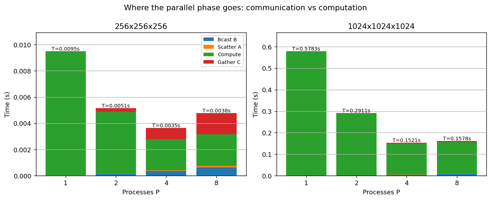
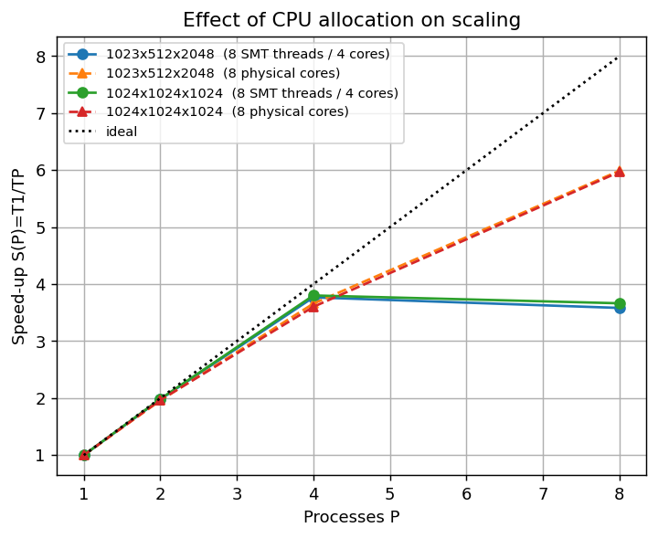

# Q1 — Distributed Matrix Multiplication (Row-Row Method)

**Course:** Distributed Systems — Home Work 2
**Section:** Distributed Algorithms (Q1)

---

## 1. Problem

Given two integer matrices `A` (dimension *m × n*) and `B` (dimension *n × p*),
compute the product `C = A × B` (dimension *m × p*) using MPI and the **Row-Row
method**.

In the Row-Row method each row of `C` is expressed as a *weighted sum of the rows
of `B`*, where the weights are the entries of the corresponding row of `A`:

```
c_i = a_i[0]·B[0,:] + a_i[1]·B[1,:] + ... + a_i[n-1]·B[n-1,:]
```

---

## 2. Approach

The work is divided across `P` MPI processes as follows:

1. **Distribute A row-wise.** The master splits `A` into row-blocks of roughly
   *m / P* rows and scatters one block to each process.
2. **Broadcast B in full.** Every process receives a complete copy of `B`,
   because computing any row of `C` needs every row of `B`.
3. **Local computation.** Each process computes its own rows of `C` independently
   as the weighted sum described above. There is **no worker-to-worker
   communication** — the row-blocks are independent.
4. **Gather C.** The master collects every process's row-block and reassembles the
   full result matrix `C`.

Because *m* need not be divisible by *P*, the distribution uses `MPI_Scatterv`
and `MPI_Gatherv` (variable-sized blocks) rather than the fixed-size `MPI_Scatter`
/ `MPI_Gather`. The first `m mod P` processes each take one extra row, so the row
counts differ by at most one and the load stays balanced.

The core MPI primitives used are: `MPI_Bcast` (dimensions and `B`),
`MPI_Scatterv` (rows of `A`), and `MPI_Gatherv` (rows of `C`).

---

## 3. Implementation details

**Input format** (`m n p` header, then both matrices in row-major order):

```
m n p
<m*n integers : matrix A>
<n*p integers : matrix B>
```

**Output:** the *m × p* result matrix `C`, printed as *m* lines of *p*
space-separated integers on **stdout**. Timing information is written to
**stderr** only, so the required program output on stdout is never polluted by
diagnostics.

**Overflow safety.** Although the inputs are integers, the accumulated products
can exceed 32-bit range for large *n*. All accumulation is therefore done in
64-bit (`long long`), and `C` is gathered as `MPI_LONG_LONG`.

**Edge cases handled.** *m* not divisible by *P*; *m = 1*, *n = 1*, *p = 1*; tall
(*m ≫ n*) and wide (*n ≫ m*) matrices; and *m < P* (in which case the surplus
processes simply receive zero rows and do nothing). A zero entry of `A`
short-circuits the inner loop as a small optimisation.

**Files**

| File | Purpose |
|------|---------|
| `rowrow_matmul.cpp` | MPI Row-Row implementation (the deliverable program) |
| `seq_matmul.cpp` | Sequential reference used to verify correctness |
| `gen_matrix.cpp` | Reproducible input generator (fixed seed) |
| `run_q1.sh` | SLURM batch script (`sbatch run_q1.sh`): compile → correctness → benchmark → plots |
| `run_q1_cores.sh` | Control experiment: same benchmark on 8 *physical* cores (§7.5) |
| `plot_speedup.py` | Turns `results/bench.txt` into the speed-up / efficiency / phase-breakdown plots |
| `tests/` | 16-case correctness suite + `correctness_results.txt` |
| `results/` | Raw timings, formatted benchmark table, plots, and the raw SLURM job log |

---

## 4. Compilation and execution

```bash
module load hpcx-2.7.0/hpcx-ompi
mpicxx -O2 -std=c++17 -o rowrow rowrow_matmul.cpp
g++    -O2 -std=c++17 -o seq    seq_matmul.cpp
g++    -O2 -std=c++17 -o gen    gen_matrix.cpp
```

Run on an allocated compute node:

```bash
mpirun -np 4 ./rowrow input.txt            # print C to stdout
mpirun -np 4 ./rowrow input.txt out.txt    # write C to out.txt
mpirun -np 4 ./rowrow --gen 1024 1024 1024 42   # generate internally, time only
```

On this cluster two launch settings are required: `--oversubscribe` (the debug
node exposes fewer cores than 8, so P=8 must share cores) and the environment
variable `OMPI_MCA_coll_hcoll_enable=0` (silences a harmless HCA/hcoll hardware
warning). Both are set inside `run_q1.sh` and `tests/run_tests.sh`, so the whole
pipeline runs with a single `sbatch run_q1.sh` from the `Q1/` directory.

`run_q1.sh` also records `nproc`, `SLURM_CPUS_ON_NODE` and `lscpu` output at the
top of its log, so the core count that the scaling analysis in §8 depends on is
documented rather than asserted.

---

## 5. Correctness verification

Correctness is verified by comparing the MPI output, **byte-for-byte**, against
the sequential reference (`seq_matmul.cpp`) for every process count P = 1, 2, 4, 8.
A dedicated 16-case suite (`tests/`) covers all required shapes and edge cases:

| Case | Shape | Stresses |
|------|-------|----------|
| PDF example 1 | 3×2×3 | Known textbook answer |
| PDF example 2 | 4×2×2 | Known answer, uneven split |
| one_by_one | 1×1×1 | Smallest possible |
| identity | 4×4×4 | A×I = A |
| zeros | 4×4×3 | Zero-skip path |
| even_split | 8×4×5 | m divisible by 2/4/8 |
| uneven_split | 7×5×4 | m not divisible by 2/4 |
| single_row | 1×6×5 | m = 1 |
| n_equals_1 | 5×1×4 | n = 1 |
| p_equals_1 | 5×4×1 | p = 1 |
| tall | 30×3×4 | m ≫ n |
| wide | 3×30×4 | n ≫ m |
| fewer_rows_than_P | 3×5×5 | m < P (idle ranks) |
| odd_dims | 13×11×7 | Awkward prime dimensions |
| square | 10×10×10 | Plain square |
| medium | 100×80×60 | Larger case |

**Result:** `TOTAL: 64 passed, 0 failed — ALL TESTS PASSED`
(16 cases × 4 process counts), from job 83598 on the cluster. Full log:
`tests/correctness_results.txt`; the unedited SLURM output is in
`results/q1_83598.out`. The two PDF examples reproduce the exact matrices given
in the assignment.

---

## 6. Benchmark methodology

- **Environment:** RCE SLURM cluster (`rce.iiit.ac.in`), `debug` partition,
  single compute node (`node07`), OpenMPI via HPC-X 2.7.0, compiled with
  `mpicxx -O2 -std=c++17`. Job 83598.
- **Node hardware:** 2 × Intel Xeon Gold 5317 @ 3.00 GHz, 12 cores per socket,
  2 threads per core (48 logical CPUs on the node). **The job was allocated 8 of
  those logical CPUs** (`nproc = 8`, `SLURM_CPUS_ON_NODE = 8`). Because the CPUs
  are SMT siblings, 8 logical CPUs correspond to **4 physical cores**. This
  number matters for every scaling conclusion below, so `run_q1.sh` records
  `nproc`, `SLURM_CPUS_ON_NODE` and `lscpu` at the top of its log rather than
  leaving it to be assumed.
- **Inputs:** square matrices of size 256, 512 and 1024 (i.e. *m = n = p*), plus
  one deliberately skewed, non-P-divisible case (1023 × 512 × 2048) so the
  benchmark also exercises the shapes named in the input constraints. All are
  generated internally with a fixed seed (42) via `--gen`, so timings exclude
  file I/O and are reproducible on a given machine.
- **Process counts:** P = 1, 2, 4, 8, launched with `mpirun --oversubscribe`.
- **Timed region:** the *whole* parallel phase, measured with `MPI_Wtime` between
  two `MPI_Barrier`s — **broadcast of `B`**, scatter of `A`, local multiplication,
  and gather of `C`. The broadcast is genuine parallel-phase communication (it
  costs essentially nothing at P = 1 but real time at P = 8), so excluding it
  would flatter the speed-up; it is therefore measured, not skipped. Only the
  three-integer dimension broadcast and the local buffer allocation sit outside
  the clock.
- **Phase breakdown:** each run additionally reports the four phases separately.
  Each phase is reduced with `MPI_MAX` across ranks, so each figure is the
  worst-case cost of that phase — the critical path, not rank 0's private view.
  This turns the communication-vs-computation discussion below into a *measured*
  split rather than an inferred one. One consequence worth stating: because
  different ranks can be the slowest in different phases, the four maxima sum to
  slightly *more* than the wall-clock total (e.g. 0.004775 s of phases against a
  0.003802 s total at 256³, P = 8). The sum is an upper bound on the critical
  path, not an exact decomposition; all percentages quoted in §8 use the
  measured wall-clock total as the denominator.
- **Control experiment.** The main run gives each rank one SMT thread, so at
  P = 8 two ranks share one physical core. To separate *hardware allocation*
  from *algorithm*, the benchmark was repeated with `--cpus-per-task=2`
  (`run_q1_cores.sh`, job 83608), which allocates 16 logical CPUs = **8 full
  physical cores**, one per rank, with `mpirun --bind-to core`. Comparing the two
  isolates the cause of the P = 8 plateau instead of speculating about it (§7.5).

Raw timings are in `results/bench.txt` and `results/bench_physical_cores.txt`
(the exact program output, consumed by `plot_speedup.py`). A formatted version
with speed-up, efficiency and the phase table is regenerated automatically into
`results/benchmark_results.txt`. The unedited SLURM logs for both jobs are kept
in `results/q1_83598.out` and `results/q1_cores_83608.out`.

---

## 7. Results

All figures below come from job 83598 (`results/bench.txt`), on 8 logical CPUs
= 4 physical cores. §7.5 adds the 8-physical-core control run (job 83608).

### 7.1 Runtime (seconds)

| Input size | P=1 | P=2 | P=4 | P=8 |
|------------|:---:|:---:|:---:|:---:|
| 256×256×256    | 0.009494 | 0.005139 | 0.003528 | 0.003802 |
| 512×512×512    | 0.073175 | 0.037434 | 0.021489 | 0.024270 |
| 1024×1024×1024 | 0.578302 | 0.291111 | 0.152106 | 0.157815 |
| 1023×512×2048  | 0.574840 | 0.290470 | 0.152538 | 0.160441 |

The last row is deliberately skewed *and* has *m* = 1023 not divisible by 2, 4
or 8, so the benchmark exercises the awkward shape and the `Scatterv` remainder
path at full scale, not only in the small correctness tests.

### 7.2 Speed-up  S(P) = T₁ / T_P

| Input size | P=1 | P=2 | P=4 | P=8 |
|------------|:---:|:---:|:---:|:---:|
| 256×256×256    | 1.00 | 1.85 | 2.69 | 2.50 |
| 512×512×512    | 1.00 | 1.95 | 3.41 | 3.02 |
| 1024×1024×1024 | 1.00 | 1.99 | 3.80 | 3.66 |
| 1023×512×2048  | 1.00 | 1.98 | 3.77 | 3.58 |


*Figure 1 — Speed-up S(P) vs number of processes. Dashed line = ideal linear
speed-up. Scaling is near-ideal up to P = 4 (the physical core count) and then
turns over.*

### 7.3 Efficiency  E(P) = S(P) / P

| Input size | P=1 | P=2 | P=4 | P=8 |
|------------|:---:|:---:|:---:|:---:|
| 256×256×256    | 1.00 | 0.92 | 0.67 | 0.31 |
| 512×512×512    | 1.00 | 0.98 | 0.85 | 0.38 |
| 1024×1024×1024 | 1.00 | 0.99 | 0.95 | 0.46 |
| 1023×512×2048  | 1.00 | 0.99 | 0.94 | 0.45 |


*Figure 2 — Parallel efficiency E(P) vs number of processes. At every P,
efficiency rises with problem size.*

### 7.4 Phase breakdown

Total time split into broadcast of `B`, scatter of `A`, local computation and
gather of `C` (slowest rank per phase), for 1024×1024×1024:

| P | Bcast B | Scatter A | Compute | Gather C | Wall clock |
|:-:|--------:|----------:|--------:|---------:|-----------:|
| 1 | 0.000000 | 0.000470 | 0.576816 | 0.001016 | 0.578302 |
| 2 | 0.001200 | 0.000591 | 0.288226 | 0.001198 | 0.291111 |
| 4 | 0.004034 | 0.000944 | 0.144480 | 0.003519 | 0.152106 |
| 8 | 0.009993 | 0.001768 | 0.143774 | 0.005199 | 0.157815 |



*Figure 3 — The same algorithm at the two extremes of problem size. At 256³ the
red gather block grows until communication is most of the runtime; at 1024³ the
green compute block still dominates at every P. Bars are annotated with the
measured wall-clock total (see the `MPI_MAX` caveat in §6).*

### 7.5 Control experiment: SMT threads vs physical cores

Identical benchmark, the only change being `--cpus-per-task=2` so each rank owns
a full physical core instead of one SMT sibling (job 83608):

| 1024×1024×1024 | P=1 | P=2 | P=4 | P=8 |
|----------------|:---:|:---:|:---:|:---:|
| Total, 4 cores / 8 SMT threads | 0.578302 | 0.291111 | 0.152106 | **0.157815** |
| Total, 8 physical cores        | 0.577713 | 0.293807 | 0.160368 | **0.096768** |
| Speed-up, 8 SMT threads        | 1.00 | 1.99 | 3.80 | **3.66** |
| Speed-up, 8 physical cores     | 1.00 | 1.97 | 3.60 | **5.97** |

The skewed case behaves identically: S(8) = 3.58 on SMT threads, **5.99** on
physical cores.



*Figure 4 — The P = 8 turnover is a property of the CPU allocation, not of the
algorithm. Given eight real cores the same binary keeps scaling.*

---

## 8. Analysis: communication vs computation

### 8.1 The computation scales exactly as the row decomposition predicts

Isolating the compute phase removes all communication and shows what the
partitioning alone achieves:

| Input size | P=1 | P=2 | P=4 | P=8 |
|------------|:---:|:---:|:---:|:---:|
| 256×256×256    | 1.00 | 2.01 | 3.97 | 3.97 |
| 512×512×512    | 1.00 | 1.99 | 3.98 | 4.04 |
| 1024×1024×1024 | 1.00 | 2.00 | 3.99 | 4.01 |
| 1023×512×2048  | 1.00 | 2.00 | 3.99 | 3.96 |

*Compute-phase speed-up.* This is the central result. The row-blocks are fully
independent, so the computation scales **linearly and almost perfectly** — 3.97
to 3.99 out of an ideal 4.00 at P = 4, on every input shape including the skewed,
non-divisible one. Load balance is therefore working: giving the first *m* mod *P*
ranks one extra row keeps the row counts within one of each other, and no rank
waits noticeably for another.

At P = 8 the compute speed-up stays pinned at ≈ 4.0 on all four inputs. Four
independent measurements landing on the same ceiling is not a coincidence: the
job held **4 physical cores**, and ranks 5–8 could only run on SMT siblings that
share the same execution units. Dense matrix multiply is FP/SIMD-throughput
bound, which is precisely the workload SMT cannot help. §7.5 confirms this
directly — given 8 real cores, the same binary reaches S(8) = 5.97.

### 8.2 The communication grows with P and shrinks with problem size

Communication = broadcast of `B` + scatter of `A` + gather of `C`, as a fraction
of wall-clock time:

| Input size | P=1 | P=2 | P=4 | P=8 |
|------------|:---:|:---:|:---:|:---:|
| 256×256×256    | 0.6 % | 9.0 % | 35.6 % | **63.1 %** |
| 512×512×512    | 0.3 % | 2.4 % | 19.3 % | 33.6 % |
| 1024×1024×1024 | 0.3 % | 1.0 % | 5.6 %  | 10.7 % |
| 1023×512×2048  | 0.4 % | 1.5 % | 6.3 %  | 12.2 % |

Two trends, both explained by the algorithm's structure:

**Along a row (increasing P):** communication cost rises roughly linearly. The
broadcast of `B` goes 0.0012 → 0.0040 → 0.0100 s at 1024³ as P goes 2 → 4 → 8,
and the gather of `C` follows the same pattern. Every additional rank is another
recipient of the full *n × p* copy of `B` and another contributor to the gather,
while the compute each rank does *shrinks* as 1/P. So the ratio moves against us
at exactly the rate the model predicts.

**Down a column (increasing size):** communication cost is a *surface* quantity
and computation is a *volume* one. The transferred data is *n·p* (broadcast)
+ *m·n* (scatter) + *m·p* (gather) — quadratic — while the work is *m·n·p*
multiply-adds — cubic. Multiplying the dimensions by 4 (256 → 1024) multiplies
communication by ≈ 16 but computation by ≈ 64, so the model predicts the
communication share should fall by about 4×. Measured at P = 8 it falls from
63.1 % to 10.7 %, a factor of 5.9 — the right direction and roughly the right
magnitude, falling somewhat *faster* than the pure surface/volume argument
predicts because the fixed per-collective latency (which does not grow with the
data at all) is amortised as well. **This is why the method is efficient only
when there is enough work to amortise one broadcast and one gather.**

### 8.3 Why P = 8 is slower than P = 4

The two effects combine. Between P = 4 and P = 8 at 1024³:

- compute barely moves (0.144480 → 0.143774 s) because there are no more
  physical cores to exploit;
- communication doubles (0.008497 → 0.016960 s) because there are twice as many
  ranks to feed and collect from.

Total therefore *rises*, 0.152106 → 0.157815 s. The turnover in Figure 1 is not
the algorithm failing — it is the point where added communication is no longer
paid for by added computation. Figure 4 makes this concrete: remove the hardware
constraint and P = 8 returns S = 5.97.

### 8.4 Cost of the Row-Row method specifically

Row-Row replicates `B` on every rank. That is its defining trade-off: it buys
**zero worker-to-worker communication** — each rank computes its rows of `C`
in complete isolation — at the price of one *n × p* broadcast and a memory
footprint of *n · p* integers per rank. The measurements show this is a good
bargain for large problems (at 1024³, P = 8 the broadcast is 6.3 % of runtime
and communication overall 10.7 %) and a poor one for small ones (at 256³, P = 8
the broadcast alone is 16.4 % and communication overall 63.1 %).

Among the three collectives, the scatter of `A` is the cheapest at every P > 1
(≤ 0.0018 s across all runs), because it is the only one whose per-rank volume
actually *falls* as P grows — each rank receives just *m/P × n* elements. The
gather of `C` costs consistently more than the scatter: `C` is accumulated in
64-bit for overflow safety, so it moves twice the bytes per element that `A`
does. The broadcast is the phase that grows fastest with P, which is the
structural price of replicating `B`.

---

## 9. Implementation notes

- **Compiler flags:** `-O2 -std=c++17`. MPI via HPC-X OpenMPI (`hpcx-2.7.0`).
- **Partition:** `debug`, single node (`node07`). Jobs 83598 (main) and 83608
  (physical-core control).
- **Non-divisible sizes:** handled with `MPI_Scatterv` / `MPI_Gatherv`; the first
  `m mod P` ranks take one extra row. Ranks with zero rows are valid and simply
  contribute nothing.
- **Launch:** `mpirun --oversubscribe` (P = 8 shares the node's cores) with
  `OMPI_MCA_coll_hcoll_enable=0` to suppress a benign hardware warning; both are
  set inside `run_q1.sh`, which is a submittable `sbatch` script.
- **Timing:** printed to stderr so it never contaminates the stdout result. The
  timed region spans broadcast → scatter → compute → gather (§6).
- **Count limits:** MPI collective element counts are `int`. The program checks
  every count and displacement against `INT_MAX` up front and aborts with a clear
  message rather than silently wrapping, which matters for the "1000 × 1000 or
  more" end of the input range.
- **Portability:** the sources use explicit standard headers rather than the
  GCC-only `<bits/stdc++.h>`, so they also build under clang.

---

## 10. Conclusion

The Row-Row MPI implementation is **correct** and **scales as the method
predicts**.

**Correctness.** 64/64 checks pass — 16 cases × P = 1, 2, 4, 8 — with output
compared byte-for-byte against the sequential reference. The suite covers both
worked examples from the assignment, *m* divisible and not divisible by *P*,
*m* = 1, *n* = 1, *p* = 1, tall and wide shapes, and *m* < *P* (idle ranks).

**Scaling.** The computation itself parallelises almost perfectly: compute-phase
speed-up is 3.97–3.99 out of an ideal 4.00 at P = 4 on *every* input shape,
including the skewed, non-divisible 1023 × 512 × 2048 case. End-to-end speed-up
reaches 3.80 at P = 4 for 1024³ (efficiency 0.95).

**The P = 8 turnover is hardware, and this was verified rather than assumed.**
The job held 8 logical CPUs = 4 physical cores, so the compute phase hit a hard
ceiling at ≈ 4.0× while communication kept growing with P. Re-running with
`--cpus-per-task=2` to obtain 8 genuine physical cores lifts S(8) from 3.66 to
**5.97** with no change to the source, confirming the limit is the CPU allocation
and not the decomposition.

**Communication vs computation.** Communication is a surface cost (*n·p* +
*m·n* + *m·p* elements) against a volume of work (*m·n·p* multiply-adds), so its
share of runtime falls sharply as the problem grows: at P = 8 it is 63.1 % of
runtime at 256³ but only 10.7 % at 1024³. The Row-Row method's defining
trade-off — replicate `B` everywhere to buy zero worker-to-worker communication —
is therefore a good bargain at scale and a poor one for small matrices.
