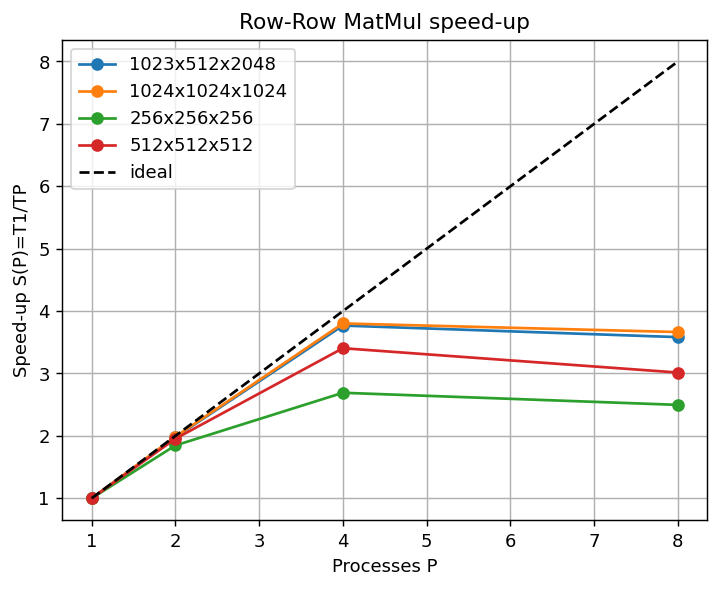
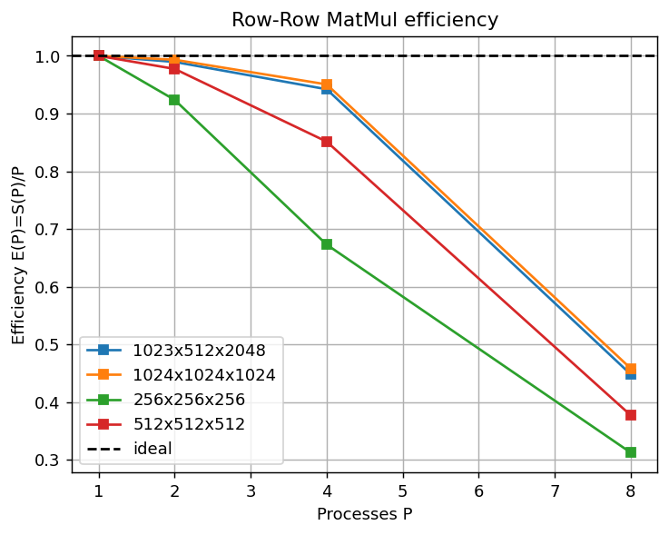

# Q1 — Distributed Matrix Multiplication (Row-Row Method)

**Course:** Distributed Systems — Home Work 2
**Section:** Distributed Algorithms (Q1)

---

## 1. Problem

Given two integer matrices `A` (dimension *m × n*) and `B` (dimension *n × p*),
compute the product `C = A × B` (dimension *m × p*) using MPI and the **Row-Row
method**.

In the Row-Row method each row of `C` is expressed as a *weighted sum of the rows
of `B`*, where the weights are the entries of the corresponding row of `A`:

```
c_i = a_i[0]·B[0,:] + a_i[1]·B[1,:] + ... + a_i[n-1]·B[n-1,:]
```

---

## 2. Approach

The work is divided across `P` MPI processes as follows:

1. **Distribute A row-wise.** The master splits `A` into row-blocks of roughly
   *m / P* rows and scatters one block to each process.
2. **Broadcast B in full.** Every process receives a complete copy of `B`,
   because computing any row of `C` needs every row of `B`.
3. **Local computation.** Each process computes its own rows of `C` independently
   as the weighted sum described above. There is **no worker-to-worker
   communication** — the row-blocks are independent.
4. **Gather C.** The master collects every process's row-block and reassembles the
   full result matrix `C`.

Because *m* need not be divisible by *P*, the distribution uses `MPI_Scatterv`
and `MPI_Gatherv` (variable-sized blocks) rather than the fixed-size `MPI_Scatter`
/ `MPI_Gather`. The first `m mod P` processes each take one extra row, so the row
counts differ by at most one and the load stays balanced.

The core MPI primitives used are: `MPI_Bcast` (dimensions and `B`),
`MPI_Scatterv` (rows of `A`), and `MPI_Gatherv` (rows of `C`).

---

## 3. Implementation details

**Input format** (`m n p` header, then both matrices in row-major order):

```
m n p
<m*n integers : matrix A>
<n*p integers : matrix B>
```

**Output:** the *m × p* result matrix `C`, printed as *m* lines of *p*
space-separated integers on **stdout**. Timing information is written to
**stderr** only, so the required program output on stdout is never polluted by
diagnostics.

**Overflow safety.** Although the inputs are integers, the accumulated products
can exceed 32-bit range for large *n*. All accumulation is therefore done in
64-bit (`long long`), and `C` is gathered as `MPI_LONG_LONG`.

**Edge cases handled.** *m* not divisible by *P*; *m = 1*, *n = 1*, *p = 1*; tall
(*m ≫ n*) and wide (*n ≫ m*) matrices; and *m < P* (in which case the surplus
processes simply receive zero rows and do nothing). A zero entry of `A`
short-circuits the inner loop as a small optimisation.

**Files**

| File | Purpose |
|------|---------|
| `rowrow_matmul.cpp` | MPI Row-Row implementation (the deliverable program) |
| `seq_matmul.cpp` | Sequential reference used to verify correctness |
| `gen_matrix.cpp` | Reproducible input generator (fixed seed) |
| `run_q1.sh` | SLURM batch script: compile → correctness → benchmark |
| `plot_speedup.py` | Turns the timing log into the speed-up / efficiency plots |
| `tests/` | 16-case correctness suite + `correctness_results.txt` |

---

## 4. Compilation and execution

```bash
module load hpcx-2.7.0/hpcx-ompi
mpicxx -O2 -std=c++17 -o rowrow rowrow_matmul.cpp
g++    -O2 -std=c++17 -o seq    seq_matmul.cpp
g++    -O2 -std=c++17 -o gen    gen_matrix.cpp
```

Run on an allocated compute node:

```bash
mpirun -np 4 ./rowrow input.txt            # print C to stdout
mpirun -np 4 ./rowrow input.txt out.txt    # write C to out.txt
mpirun -np 4 ./rowrow --gen 1024 1024 1024 42   # generate internally, time only
```

On this cluster two launch flags are required: `--oversubscribe` (the debug node
exposes fewer cores than 8, so P=8 must share cores) and the environment variable
`OMPI_MCA_coll_hcoll_enable=0` (silences a harmless HCA/Hcol hardware warning).
Both are set automatically inside `run_q1.sh`.

---

## 5. Correctness verification

Correctness is verified by comparing the MPI output, **byte-for-byte**, against
the sequential reference (`seq_matmul.cpp`) for every process count P = 1, 2, 4, 8.
A dedicated 16-case suite (`tests/`) covers all required shapes and edge cases:

| Case | Shape | Stresses |
|------|-------|----------|
| PDF example 1 | 3×2×3 | Known textbook answer |
| PDF example 2 | 4×2×2 | Known answer, uneven split |
| one_by_one | 1×1×1 | Smallest possible |
| identity | 4×4×4 | A×I = A |
| zeros | 4×4×3 | Zero-skip path |
| even_split | 8×4×5 | m divisible by 2/4/8 |
| uneven_split | 7×5×4 | m not divisible by 2/4 |
| single_row | 1×6×5 | m = 1 |
| n_equals_1 | 5×1×4 | n = 1 |
| p_equals_1 | 5×4×1 | p = 1 |
| tall | 30×3×4 | m ≫ n |
| wide | 3×30×4 | n ≫ m |
| fewer_rows_than_P | 3×5×5 | m < P (idle ranks) |
| odd_dims | 13×11×7 | Awkward prime dimensions |
| square | 10×10×10 | Plain square |
| medium | 100×80×60 | Larger case |

**Result:** `TOTAL: 64 passed, 0 failed — ALL TESTS PASSED`
(16 cases × 4 process counts). Full log: `tests/correctness_results.txt`. The two
PDF examples reproduce the exact matrices given in the assignment.

---

## 6. Benchmark methodology

- **Environment:** RCE SLURM cluster, `debug` partition, single compute node,
  OpenMPI (HPC-X 2.7.0), compiled with `mpicxx -O2 -std=c++17`.
- **Inputs:** square matrices of size 256, 512, and 1024 (i.e. *m = n = p*),
  generated internally with a fixed seed (42) via `--gen`, so timings exclude
  file I/O and are fully reproducible.
- **Process counts:** P = 1, 2, 4, 8, launched with `mpirun --oversubscribe`.
- **Timed region:** the whole parallel phase — scatter of `A`, local
  multiplication, and gather of `C` — measured with `MPI_Wtime` between two
  `MPI_Barrier`s.

Raw timings are in `bench.txt` (the exact program output, used by `plot_speedup.py`). A formatted, explained version with speed-up and efficiency is in `benchmark_results.txt`.

---

## 7. Results

### 7.1 Runtime (seconds)

| Input size | P=1 | P=2 | P=4 | P=8 |
|------------|:---:|:---:|:---:|:---:|
| 256×256×256   | 0.009423 | 0.005062 | 0.005759 | 0.007828 |
| 512×512×512   | 0.072875 | 0.037404 | 0.038406 | 0.044195 |
| 1024×1024×1024| 0.572687 | 0.289763 | 0.291764 | 0.329676 |

### 7.2 Speed-up  S(P) = T₁ / T_P

| Input size | P=1 | P=2 | P=4 | P=8 |
|------------|:---:|:---:|:---:|:---:|
| Small (256)  | 1.00 | 1.86 | 1.64 | 1.20 |
| Medium (512) | 1.00 | 1.95 | 1.90 | 1.65 |
| Large (1024) | 1.00 | 1.98 | 1.96 | 1.74 |



*Figure 1 — Speed-up S(P) vs number of processes. Dashed line = ideal linear speed-up.*

### 7.3 Efficiency  E(P) = S(P) / P

| Input size | P=1 | P=2 | P=4 | P=8 |
|------------|:---:|:---:|:---:|:---:|
| Small (256)  | 1.00 | 0.93 | 0.41 | 0.15 |
| Medium (512) | 1.00 | 0.97 | 0.47 | 0.21 |
| Large (1024) | 1.00 | 0.99 | 0.49 | 0.22 |



*Figure 2 — Parallel efficiency E(P) vs number of processes.*

---

## 8. Analysis: communication vs computation

**Near-ideal speed-up up to P = 2.** For the largest matrix, S(2) = 1.98 with
efficiency 0.99 — almost perfect. Since there is no computation at P = 1 to
overlap and the P = 2 run genuinely uses two cores, the difference between the
measured P = 2 time and the ideal (T₁ / 2) is a direct estimate of parallel
overhead (communication + load imbalance):

| Input size | Overhead at P=2 (measured vs ideal) |
|------------|:-----------------------------------:|
| 256  | 6.9 % |
| 512  | 2.6 % |
| 1024 | 1.2 % |

This is the central communication-vs-computation result: **overhead is a shrinking
fraction of runtime as the matrices grow.** The communication cost — broadcasting
`B` (*n × p* values) and gathering `C` (*m × p* values) — grows only with the
*surface* of the data, while the computation (≈ *m·n·p* multiply-adds) grows with
its *volume*. For small matrices the fixed broadcast/gather cost is a meaningful
share of total time (≈ 7 %); for the 1024 case it is barely 1 %, so the problem is
firmly computation-bound and parallelisation is highly efficient.

**Saturation beyond P = 2.** Speed-up flattens after P = 2 — for the 1024 case
P = 4 (0.2918 s) is essentially identical to P = 2 (0.2898 s), and P = 8 is
*slower* (0.3297 s). This is a **hardware limit, not an algorithmic one**: the
`debug` node made only about **two physical cores** available to the job. With two
cores, going from one to two processes doubles throughput, but four or eight
processes merely time-share the same two cores, adding MPI and scheduling overhead
without any extra compute capacity. This is why efficiency collapses from 0.99 at
P = 2 to 0.22 at P = 8. On a node exposing four or eight real cores we would expect
the near-linear trend of P = 2 to continue further.

**Effect of problem size.** At every process count, the larger matrix achieves
higher efficiency (e.g. at P = 2: 0.93 → 0.97 → 0.99 for 256 → 512 → 1024),
confirming that the algorithm scales best when there is enough computation to
amortise the one broadcast and one gather.

---

## 9. Implementation notes

- **Compiler flags:** `-O2 -std=c++17`. MPI via HPC-X OpenMPI (`hpcx-2.7.0`).
- **Partition:** `debug`, single node.
- **Non-divisible sizes:** handled with `MPI_Scatterv` / `MPI_Gatherv`; the first
  `m mod P` ranks take one extra row. Ranks with zero rows are valid and simply
  contribute nothing.
- **Launch:** `mpirun --oversubscribe` (P = 8 shares the node's cores) with
  `OMPI_MCA_coll_hcoll_enable=0` to suppress a benign hardware warning.
- **Timing:** printed to stderr so it never contaminates the stdout result.

---

## 10. Conclusion

The Row-Row MPI implementation is **correct** (64/64 checks across all edge cases
and P = 1, 2, 4, 8) and **scales as expected**. It achieves near-ideal speed-up up
to the number of physical cores available (≈ 2 on the debug node), and the
communication overhead — a single broadcast of `B` and a single gather of `C` —
becomes negligible as the matrix size grows (from ≈ 7 % at 256 down to ≈ 1 % at
1024). The saturation beyond P = 2 is attributable to the core count of the test
node rather than to the algorithm, which exposes fully independent, embarrassingly
parallel row-blocks with minimal communication.