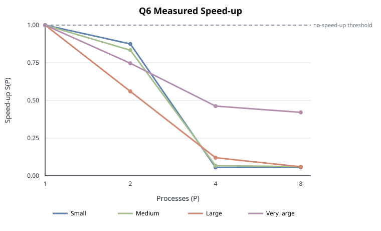

# Q6. Connected Components of a Large Graph

## Results Table

Speed-up $S(P) = T_1 / T_P$, from the end-to-end runtime reported by the MPI
program.

| Input size | $P=1$ | $P=2$ | $P=4$ | $P=8$ |
|------------|:-----:|:-----:|:-----:|:-----:|
| Small (V=5, E=3)          | 1.00 | 0.88 | 0.06 | 0.06 |
| Medium (V=500, E=2.5k)    | 1.00 | 0.83 | 0.07 | 0.06 |
| Large (V=5k, E=25k)       | 1.00 | 0.56 | 0.12 | 0.06 |
| Very large (V=100k, E=1M) | 1.00 | **0.75** | 0.46 | 0.42 |

## Runtime Table

End-to-end seconds: graph input/distribution + connected-component computation
+ output.

| Input size | Vertices | Undirected edges | $P=1$ | $P=2$ | $P=4$ | $P=8$ |
|------------|---------:|-----------------:|------:|------:|------:|------:|
| Small      | 5       | 3         | 0.0007 | 0.0008 | 0.0126 | 0.0125 |
| Medium     | 500     | 2,500     | 0.0010 | 0.0012 | 0.0150 | 0.0165 |
| Large      | 5,000   | 25,000    | 0.0028 | 0.0050 | 0.0234 | 0.0469 |
| Very large | 100,000 | 1,000,000 | 0.0560 | 0.0750 | 0.1211 | 0.1331 |

The program's diagnostic output reports twice the undirected edge count, because
it counts adjacency-list entries and every generated edge occurs in both
endpoints' lists. Graphs generated by `gen_graph.py --suite` with seed 42; the
small case is the exact sample input from `task.md`.

## Efficiency

$E(P) = S(P)/P$, shown as a percentage.

| Input size | $P=1$ | $P=2$ | $P=4$ | $P=8$ |
|------------|:-----:|:-----:|:-----:|:-----:|
| Small      | 100.00% | 43.75% | 1.39% | 0.70% |
| Medium     | 100.00% | 41.67% | 1.67% | 0.76% |
| Large      | 100.00% | 28.00% | 2.99% | 0.75% |
| Very large | 100.00% | 37.33% | 11.56% | 5.26% |

## Speed-up vs. $P$ graph

*Figure 6.1 — Measured speed-up for Q6. All curves stay below 1.*

## Communication vs. Computation

IPM measured the following percentage of aggregate process wall time inside MPI
calls. The remainder includes local computation, input, and output.

| Input size | $P=1$ | $P=2$ | $P=4$ | $P=8$ |
|------------|:-----:|:-----:|:-----:|:-----:|
| Small      | 0.02% | 0.32% | 8.32% | 7.40% |
| Medium     | 0.02% | 0.31% | 10.71% | 12.46% |
| Large      | 0.03% | 4.23% | 15.30% | 26.93% |
| Very large | 0.77% | 18.27% | **45.80%** | **47.35%** |

For the very-large case at $P=8$, IPM attributes 17.12% of wall time to
`MPI_Scatterv`, 12.60% to `MPI_Barrier`, 9.29% to `MPI_Bcast`, and 8.33% to
`MPI_Allreduce`. Communication and synchronisation therefore consume almost half
of aggregate wall time at the largest process count.

**The workload is too small to parallelise profitably.** At the given maximum constraints ($V = 10^5$, $E = 10^6$) the entire component computation is only
~10 ms. Against that, one `Allreduce` of $10^5$ ints per round plus the scatter
of the edge set is not amortisable, and $S(P) < 1$ everywhere.

**The local computation does scale, once MPI time is subtracted.** The program
reports the MPI portion of its compute phase separately, so pure local work can
be isolated (very-large case):

| $P$ | compute phase | of which MPI | local compute only | local-only $S(P)$ |
|-----|:-------------:|:------------:|:------------------:|:-----------------:|
| 1 | 0.0117 | 0.0000 | 0.0117 | 1.00 |
| 2 | 0.0132 | 0.0008 | 0.0124 | 0.94 |
| 4 | 0.0222 | 0.0145 | 0.0077 | 1.52 |
| 8 | 0.0204 | 0.0152 | 0.0052 | **2.25** |

## Correctness

MPI output `diff`ed against `cc_seq` (sequential union-find) at every process
count.

## Implementation Notes

- **Compile flags:** `mpicxx -g -O2 -std=c++17` for the MPI program;
  `g++ -g -O2 -pg -std=c++17` for the sequential program (`-pg` for gprof).
  MPI via HPC-X OpenMPI 2.7.0.
- **Algorithm:** distributed label propagation accelerated by a local union-find.
  `lab[v]` starts at `v`; each round every process (1) seeds a union-find with
  what is already known — `union(i, lab[i])` for all `i`; (2) unions the
  endpoints of the edges of the vertices **it owns**; (3) sets
  `newlab[i] = find(i)` (a set's root is always its smallest id); (4)
  `MPI_Allreduce(MPI_MIN)` merges what every process learned. The loop stops when
  the label array stops changing. Labels only ever decrease and always name a
  vertex in the same true component, so termination is guaranteed; at the
  fixpoint labels are constant across every edge, which makes each label the
  component minimum. Because step 1 folds in *all* previously merged information,
  the merge reach roughly doubles per round — **2–4 rounds** in practice, even
  for a long chain (the worst case for plain one-hop propagation) split across 8
  processes.
- **Cost per round:** $O(V + E_{local}\cdot\alpha)$ compute, one `Allreduce` of
  $V$ ints.
- **Handling non-divisible sizes:** vertices are block-distributed and adjacency
  lists handed out with `MPI_Scatterv`, so no rank stores the whole edge set and
  a $V$ not divisible by $P$ needs no special case. The $V$-sized label array is
  replicated on every rank — 400 KB at $V \le 10^5$ — which is what makes the
  single-collective-per-round design worthwhile. Adjacency lists need not be
  symmetric; self-loops and duplicate edges are fine.
- **Launch:** `mpirun --bind-to none --oversubscribe`. `--bind-to none` is
  required because the default core binding refuses to launch when a node has
  fewer visible CPUs than ranks, which is the case at $P=8$ on this partition.
  `OMPI_MCA_coll_hcoll_enable=0` silences a benign "no HCA device" warning.
- **Profiling:** IPM via `LD_PRELOAD` with `IPM_REPORT=full` for the MPI
  breakdown; gprof for the sequential program.

## Conclusion

The implementation is **correct** but **does not speed up**: $S(P) < 1$ at every size and process count. The cause is
that the problem is latency-bound rather than compute-bound. At the assignment's
stated maximum the whole computation is ~10 ms, against which IPM measures 46–47 %
of wall time inside MPI calls at $P = 4$–8, and the multi-node allocation adds a
fixed ~10 ms of inter-node collective latency that alone exceeds the computation.
The local union-find work does parallelise — 2.25× at $P=8$ once MPI time is
subtracted — so the limitation is the communication pattern, not the local
algorithm. The targeted fix is boundary-only point-to-point exchange in place of
the full-array `Allreduce`, since boundary vertices grow with $P$ while each
rank's local share shrinks.
