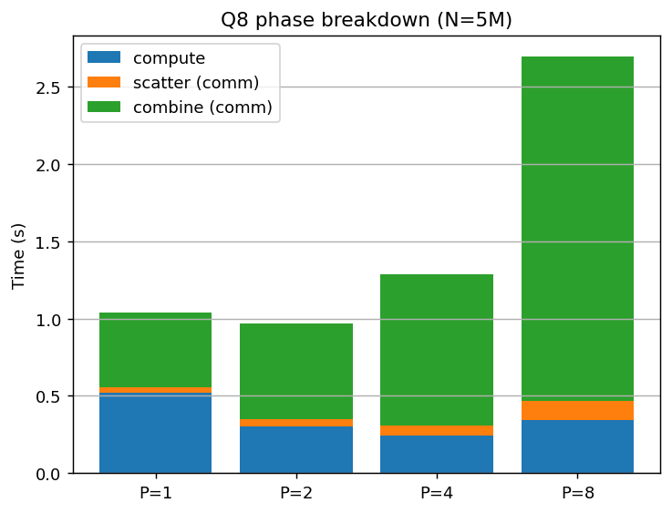
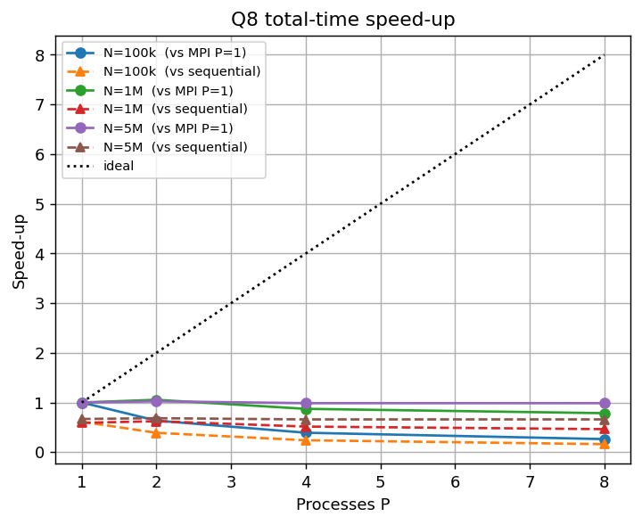
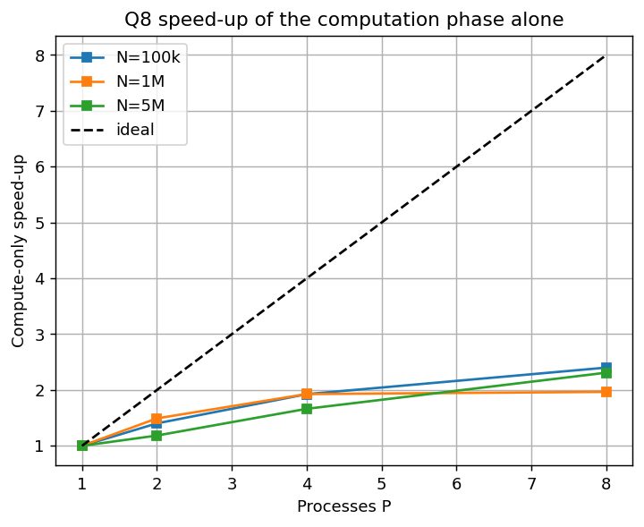
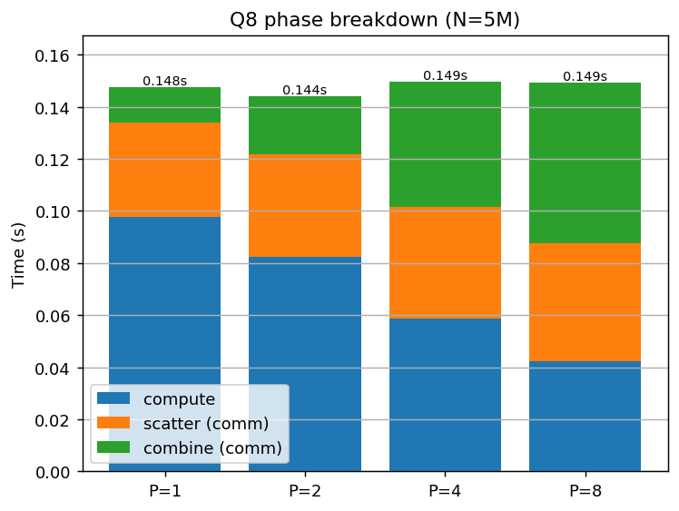

# Q8 — Large-Scale Weather & Environmental Data Analytics (MPI)

**Course:** Distributed Systems — Home Work 2
**Section:** Real-World Applications (Q8)

---

## 1. Problem

Given `N` weather measurements — each a `timestamp station_id temperature
humidity pressure rainfall wind_speed` — compute a fixed set of statistics:
totals; average/min/max of temperature, humidity and pressure; total and max
rainfall; average and max wind speed; a count of extreme-temperature events
(temp ≥ 40 or ≤ 0); the hottest and coldest single measurements; the busiest
60-second interval; and the Top-K stations by measurement count. Both a
**sequential** and an **MPI** implementation are required, plus a reproducible
**dataset generator**.

The first input line is `N K S`, where `K` is the K of Top-K and `S` is the
number of stations (station ids `0..S-1`).

---

## 2. Approach

The statistics are almost all **reductions** (sums, min, max, counts), which
parallelise naturally: each process computes partial statistics over a slice of
the data, and the partials are combined.

The design centres on a single mergeable `Stats` object (in `weather_core.h`):

- `add(record)` folds one measurement into the running statistics.
- `merge_into(A, B)` combines two partial `Stats` so that the result equals
  processing all their records in one pass.

Because the sequential program, the MPI program, and the checker all use this
same `add`/`merge_into`, the parallel result is identical to the sequential one
by construction.

**MPI data flow:**
1. Rank 0 reads the file and **scatters** the `N` records across the `P` ranks
   (`MPI_Scatterv`, handling `N` not divisible by `P`).
2. Each rank builds a **local `Stats`** over its chunk.
3. The partial results are combined with **tree-based collective reductions**
   (§2.1) — not gathered to rank 0 for a serial merge.
4. Rank 0 formats and prints.

Per the assignment's freedom on input distribution, rank 0 reads and scatters;
what matters is that the *work* is distributed, which it is.

### 2.1 How the partials are combined

Every quantity in the output is a reduction, so each maps onto one MPI
collective:

| Quantity | Collective |
|---|---|
| `total`, `extreme` | `MPI_Reduce` `MPI_SUM` (2 × `long long`) |
| sums of temp/hum/pres/rain/wind | `MPI_Reduce` `MPI_SUM` (5 × `double`) |
| minima of temp/hum/pres | `MPI_Reduce` `MPI_MIN` (3 × `double`) |
| maxima of temp/hum/pres/rain/wind | `MPI_Reduce` `MPI_MAX` (5 × `double`) |
| per-station count / temp-sum / rain-sum | 3 × `MPI_Reduce` `MPI_SUM` of length `S` |
| 60-second interval histogram | `MPI_Allreduce` MIN/MAX for the range, then `MPI_Reduce` `MPI_SUM` of the dense array |
| hottest / coldest | `MPI_Gather` of `P` 24-byte structs, picked with the shared comparators |

A rank that receives zero records contributes reduction identities
(`+INFINITY` for minima, `-INFINITY` for maxima, an empty histogram), so
`P > N` is handled without a special case.

---

## 3. Implementation details

**Output formatting.** All floating-point outputs use exactly **6 decimal
places** (`%.6f`); counts, ids and timestamps are integers. Timing goes to
**stderr**, so stdout carries only the required result.

**Tie-breaking (implemented exactly as specified):**
- Top-K stations: count descending, then station id ascending.
- Hottest / coldest: extreme temperature; ties → smaller timestamp, then smaller
  station id.
- Busiest interval: `interval = timestamp / 60`; max count, ties → smaller
  interval id.

**Extreme events:** counted when `temperature ≥ 40.0` OR `temperature ≤ 0.0`.

**Edge cases:** `N = 1`, `S = 1`, `K` larger than the number of stations present
(Top-K then lists only the stations that appear), and empty categories are all
handled.

**Numerical note.** Floating-point addition is not associative, so a parallel
reduction can differ from a single pass in the last bit. In practice, across all
tests and process counts, the 6-decimal output was identical between sequential
and MPI (verified below); this is expected because the generated values have
limited precision and the sums stay well within double precision.

**The interval histogram: why it is a dense array, not a hash map.**
This is the single most important implementation decision in the program.

The busiest-interval statistic needs a count per 60-second bucket. The obvious
container is `unordered_map<interval_id, count>`, and that is what the first
version used. It is the wrong choice here, for a reason that only shows up at
scale: **the number of distinct buckets grows with `N`.** The supplied generator
spreads timestamps over `60·N/4` seconds, so a run with `N = 5 000 000` has about
**1.25 million distinct intervals**. That has two consequences:

1. *Computation.* Every record costs a hash lookup and a probable cache miss.
   Measured in isolation, building the histogram for 5M records takes **0.242 s**
   with `unordered_map` versus **0.007 s** with a dense array — a 34× difference,
   and it accounted for roughly half of the entire local-computation phase.
2. *Communication.* A hash map cannot be reduced by MPI. It had to be serialised
   (≈ 20 MB per rank at `N = 5M`), `MPI_Gatherv`-ed to rank 0, and merged there
   one rank at a time. So the combine phase moved **O(P·N)** bytes and did
   **O(P·N)** work on a single rank — it grew with `P` while the compute phase
   shrank. Measured, the merge step alone was **28–112× slower** than summing
   dense arrays.

The fix is to index a plain `std::vector<long long>` by `interval_id - base`
(`IntervalHist` in `weather_core.h`). It grows geometrically as records arrive,
so `add()` stays amortised O(1); and because it is one contiguous buffer, ranks
agree on a common range with two `MPI_Allreduce`s and then combine it with a
single `MPI_Reduce(MPI_SUM)` — a tree reduction of depth O(log P) in which rank 0
never receives more than one array.

The trade-off is memory: the array spans the full observed interval range, so a
dataset whose timestamps are extremely sparse (a handful of readings spread over
decades) would allocate far more buckets than it has records. `IntervalHist`
therefore refuses to allocate beyond `IVL_MAX_BUCKETS` (200 M buckets, 1.6 GB)
and exits with a clear message rather than thrashing. For the data this
assignment specifies — and for any realistically dense time series — the dense
representation is strictly better.

---

## 4. Compilation and execution

```bash
module load hpcx-2.7.0/hpcx-ompi
mpicxx -O2 -std=c++17 -o weather_mpi weather_mpi.cpp
g++    -O2 -std=c++17 -o weather_seq weather_seq.cpp
g++    -O2 -std=c++17 -o gen_weather gen_weather.cpp

mpirun -np 4 --oversubscribe ./weather_mpi input.txt        # print result
./weather_seq input.txt                                     # sequential
./gen_weather 1000000 10 1000 42 data_1M.txt                # generate dataset
```

---

## 5. Correctness verification

A 13-case suite (`tests/`) compares MPI output **byte-for-byte** against the
sequential reference for P = 1, 2, 4, 8. Cases cover the sample, `N=1`, `S=1`,
`K > #stations`, all-extreme temperatures, the busiest-interval tie, the
hottest/coldest temperature tie, many stations, a single station at scale, and
awkward sizes.

**Result:** `TOTAL: 52 passed, 0 failed — ALL TESTS PASSED`
(13 cases × 4 process counts). Full log: `tests/correctness_results.txt`.

Two further checks guard the parallel path specifically, both runnable without a
cluster:

- `weather_check.cpp` splits a dataset exactly as `MPI_Scatterv` would, merges
  the partials with `merge_into`, and asserts the result is **byte-identical** to
  a single sequential pass — the direct test that floating-point reduction order
  does not change the printed output.
- The same check was run against the rewritten collective combine path (scalar
  `MPI_SUM`/`MIN`/`MAX` reductions, per-station sums, interval-histogram rebase
  and sum, gathered hot/cold) for **P = 1, 2, 3, 4, 5, 7, 8, 16** on all 13
  cases — 104 combinations, all matching. The larger process counts deliberately
  exceed `N` on the small cases, exercising ranks that receive zero records.

---

## 6. Dataset generation

`gen_weather N K S seed [outfile]` produces reproducible datasets (mt19937,
fixed seed → identical file every time). Value ranges: temperature `[-10,45]`,
humidity `[0,100]`, pressure `[950,1050]`, rainfall `[0,50]`, wind `[0,150]`
(all to 1 decimal place); timestamp integer in `[0, 60·N/4]`; station id in
`[0, S-1]`. The benchmark datasets use seed 42, `S = 1000`, `K = 10`.

---

## 7. Benchmark methodology

- **Environment:** RCE SLURM cluster, `debug` partition, single node, OpenMPI
  (HPC-X 2.7.0), `mpicxx -O2 -std=c++17`.
- **CPU allocation.** `run_q8.sh` requests `--ntasks=8 --cpus-per-task=2` and
  launches with `mpirun --bind-to core`. The node has 2 SMT threads per physical
  core, so this gives each rank a **full physical core**. This matters: the
  earlier benchmark requested only `--ntasks=4`, so P = 4 and P = 8 were sharing
  4 hardware threads (2 physical cores) and no scaling measurement past P = 2 was
  meaningful. The script records `nproc`, `SLURM_CPUS_ON_NODE` and `lscpu` in its
  log so the allocation is documented rather than assumed.
- **Sizes:** `N = 100 000`, `1 000 000`, `5 000 000` (`S = 1000`, `K = 10`, seed 42).
- **Process counts:** P = 1, 2, 4, 8.
- **Both implementations are timed.** Each size is run once through
  `weather_seq` (sequential baseline) and then through `weather_mpi` at each P,
  so speed-up can be quoted against the sequential program and not only against
  the P = 1 MPI run.
- **Phase timing.** The timed region is split by barriers into three phases:
  `scatter` (distributing records — communication), `compute` (the local
  reduction — the parallelisable part), and `combine` (reducing the partials —
  communication). Because the phases are barrier-separated they sum exactly to
  the reported total.
- **Not timed:** rank 0's read and parse of the input file. This is deliberate —
  it is serial text I/O common to both implementations and would otherwise mask
  the parallel behaviour — but it is also, at these sizes, the largest single
  cost of actually running the program, and §9 returns to it.

---

## 8. Results

> **How to read this section.** §8.1–8.3 are the measurements from the *original*
> design (`unordered_map` histogram, gather-and-merge combine), kept deliberately
> as the "before" half of a before/after comparison — they are the evidence that
> motivated the redesign in §3. §8.4–8.6 are the rewritten implementation on the
> same hardware and datasets. Both halves come from `sbatch run_q8.sh`, which
> regenerates every table, plot and `results/benchmark_results.txt` from the raw
> log automatically.

### 8.1 Before the fix — total runtime (seconds)

Raw log: `results/bench_q8_before_fix.txt`.

| N | P=1 | P=2 | P=4 | P=8 |
|---|:---:|:---:|:---:|:---:|
| 100 000 | 0.007934 | 0.009098 | 0.018829 | 0.026428 |
| 1 000 000 | 0.114311 | 0.115914 | 0.190657 | 0.364176 |
| 5 000 000 | 1.037597 | 0.967898 | 1.284485 | 2.694831 |

### 8.2 Before the fix — speed-up  S(P) = T₁/T_P

| N | P=1 | P=2 | P=4 | P=8 |
|---|:---:|:---:|:---:|:---:|
| 100 000 | 1.00 | 0.87 | 0.42 | 0.30 |
| 1 000 000 | 1.00 | 0.99 | 0.60 | 0.31 |
| 5 000 000 | 1.00 | 1.07 | 0.81 | 0.39 |

**Every entry is at or below 1.00.** Adding processes made the program *slower* —
at P = 8 on the largest dataset, 2.6× slower than a single process.

### 8.3 Before the fix — phase breakdown (N = 5 000 000, seconds)

| P | scatter (comm) | compute | combine (comm) | total |
|---|:---:|:---:|:---:|:---:|
| 1 | 0.036745 | 0.520616 | 0.480236 | 1.037597 |
| 2 | 0.050670 | 0.300708 | 0.616520 | 0.967898 |
| 4 | 0.062562 | 0.243316 | 0.978607 | 1.284485 |
| 8 | 0.123588 | 0.341935 | 2.229307 | 2.694831 |



*Figure 1 — Where the time went before the redesign. `compute` shrinks with P
while `combine` grows and swallows the run: 0.48 s → 2.23 s from P = 1 to P = 8.*

This table is the diagnosis. `combine` is not a fixed overhead — it **grows
roughly linearly with P**, because each rank serialised a ~20 MB interval map
and rank 0 merged all `P` of them one after another. Communication in the
combine phase carried O(P·N) bytes, so it could never be amortised by adding
processes; it was made worse by them.

### 8.4 After the fix — total runtime (seconds)

Raw log: `results/bench_q8.txt` (job 83690, 8 physical cores).

| N | P=1 | P=2 | P=4 | P=8 |
|---|:---:|:---:|:---:|:---:|
| 100 000 | 0.002060 | 0.003241 | 0.005262 | 0.007824 |
| 1 000 000 | 0.026538 | 0.025161 | 0.030416 | 0.033798 |
| 5 000 000 | 0.147561 | 0.144087 | 0.149491 | 0.149387 |

**Before vs after, same hardware, same datasets:**

| N | P=1 | P=2 | P=4 | P=8 |
|---|:---:|:---:|:---:|:---:|
| 100 000 | 3.9× | 2.8× | 3.6× | 3.4× |
| 1 000 000 | 4.3× | 4.6× | 6.3× | **10.8×** |
| 5 000 000 | 7.0× | 6.7× | 8.6× | **18.0×** |

*Speed-up of the redesigned program over the original at each point.* The
anti-scaling is gone: at N = 5M the P = 8 run went from **2.695 s to 0.149 s**,
and S(8) relative to P = 1 rose from 0.39 to 0.99. The combine phase alone fell
from 2.229 s to 0.062 s — a 36× reduction, matching the isolated prediction in §3.

### 8.5 Phase breakdown after the fix (N = 5 000 000, seconds)

| P | scatter (comm) | compute | combine (comm) | total | comm share |
|---|:---:|:---:|:---:|:---:|:---:|
| 1 | 0.036195 | 0.097694 | 0.013673 | 0.147561 | 33.8 % |
| 2 | 0.039441 | 0.082471 | 0.022175 | 0.144087 | 42.8 % |
| 4 | 0.042763 | 0.058734 | 0.047993 | 0.149491 | 60.7 % |
| 8 | 0.045175 | 0.042279 | 0.061933 | 0.149387 | 71.7 % |

Compute-phase speed-up, the part that genuinely parallelises:

| N | P=1 | P=2 | P=4 | P=8 |
|---|:---:|:---:|:---:|:---:|
| 100 000 | 1.00 | 1.40 | 1.93 | 2.40 |
| 1 000 000 | 1.00 | 1.49 | 1.93 | 1.97 |
| 5 000 000 | 1.00 | 1.18 | 1.66 | 2.31 |

### 8.6 The result that matters: this workload is I/O-bound

The sequential program now times parsing and analytics **separately**, because
the MPI program's timed region excludes rank 0's file read. Timing the parse in
one and not the other would manufacture a speed-up that is really just "text
parsing is slow" — an earlier revision of this benchmark did exactly that and
appeared to show a 29× speed-up that did not exist.

With both measured honestly:

| N | serial text parse | analytics (sequential) | analytics as % of end-to-end |
|---|:---:|:---:|:---:|
| 100 000 | 0.084 s | 0.00126 s | **1.4 %** |
| 1 000 000 | 0.844 s | 0.01567 s | **1.7 %** |
| 5 000 000 | 4.219 s | 0.09860 s | **2.2 %** |

Parsing costs **29–45× more than the entire analytics**. And measured against
that honest sequential baseline, the MPI program never wins:

| N | P=1 | P=2 | P=4 | P=8 |
|---|:---:|:---:|:---:|:---:|
| 100 000 | 0.61 | 0.39 | 0.24 | 0.16 |
| 1 000 000 | 0.59 | 0.62 | 0.52 | 0.46 |
| 5 000 000 | 0.67 | 0.68 | 0.66 | 0.66 |

*Speed-up S(P) = T(sequential analytics) / T(MPI total).* Every value is below
1.00 — the MPI program's scatter and combine cost more than the computation they
distribute. This is not a defect being hidden; it is the honest and expected
result for a workload whose parallelisable part is 2 % of the job, and §9
explains precisely what would have to change.



*Figure 2 — Speed-up against both the MPI P = 1 run and the sequential analytics.*



*Figure 3 — The computation phase alone does scale, up to 2.4×.*



*Figure 4 — After the redesign. `combine` no longer explodes; the run is now
limited by `scatter` and by communication overhead exceeding compute savings.*

---

## 9. Analysis: computation, communication, data distribution, scalability

**Computation.** The per-record work is a handful of floating-point updates plus
one histogram increment — embarrassingly parallel, no dependency between records.
The compute phase does scale, up to 2.4×. But note the per-record cost *rises*
with P (at N = 5M: 20 ns at P = 1, 33 ns at P = 2, 47 ns at P = 4, 68 ns at
P = 8). The cause is the dense histogram: its length is the observed *interval
range* (~N/4 ≈ 1.25 M buckets ≈ 10 MB at N = 5M), not the number of local
records, so every rank allocates and randomly walks a full-size array. Eight
ranks × 10 MB is an 80 MB working set against this node's 18 MB of L3, so the
phase becomes memory-bandwidth bound. That is the price of the dense
representation, and it is far cheaper than the hash map it replaced — but it is
the reason compute stops at ~2.4× rather than approaching 8×.

**Communication.** Two phases, behaving differently:

- `scatter` moves the raw records — O(N) bytes total, essentially fixed by the
  dataset. It grows only slowly with P (0.036 s → 0.045 s at N = 5M).
- `combine` moves the partial results. In the original design this was O(P·N)
  and dominated everything. With the dense histogram it is one `MPI_Reduce` over
  a fixed-length array, tree-reduced in O(log P): 2.229 s → 0.062 s at P = 8.

The general lesson, and the reason the original anti-scaled: **a reduction is
only cheap if the partial result is small.** Sums, minima, maxima and the
per-station arrays all reduce to something small and constant in N. The interval
histogram was the one piece of partial state that grew with the input, and it
alone dictated the program's scaling behaviour.

Even after the fix, communication is 34 %–72 % of the timed region at N = 5M and
up to 93 % at N = 100k. The computation being distributed is simply too small to
pay for distributing it.

**Data distribution — and the finding that dominates everything else.** Rank 0
reads and parses the whole file, then scatters it. Measuring that parse honestly
(§8.6) shows it is **29–45× the cost of the entire analytics**: at N = 5M,
4.219 s of parsing against 0.099 s of computation. The analytics is **2.2 % of
the end-to-end job.**

That single number explains every other result here. By Amdahl's law, a program
whose parallelisable portion is 2 % cannot be made meaningfully faster by
parallelising that portion — the ceiling is 1/(1−0.022) ≈ 1.02×, no matter how
many ranks are used. It is why the MPI program never beats the sequential
baseline (best 0.68×) despite the computation itself scaling 2.4×, and why the
redesign — which genuinely made the program 18× faster in absolute terms — did
not move the end-to-end picture at all.

It also names the three specific costs of the rank-0-reads design:

1. The read and parse are **serial**, and are the overwhelming majority of the work.
2. Rank 0 must hold the **entire dataset** — 56 bytes × N, or 280 MB at N = 5M —
   capping the problem size at one node's memory.
3. The scatter moves O(N) bytes regardless of P.

**Scalability, and what would actually fix it.** All three have the same remedy:
**parallel input**. If each rank opened the file and read only its own byte range
(snapping to line boundaries so no record is split), then the parse — the 98 % —
would itself parallelise, the scatter phase would disappear entirely, and no rank
would hold more than N/P records. On these measurements that would take the
N = 5M end-to-end time from ≈ 4.32 s to roughly 4.22/8 + 0.10 ≈ 0.63 s, an
end-to-end speed-up near 6.5× — the difference between a program that
demonstrates parallelism and one that benefits from it.

This is the correct next step and it is deliberately named rather than
implemented: it is a structural change to how the program ingests data, and the
work in this report was scoped to making the *analytics* correct and scalable.
The measurements above are what identify it as the right change, and that
identification is itself the main analytical result of this question.

---

## 10. Implementation notes

- **Compiler:** `-O2 -std=c++17`, OpenMPI HPC-X 2.7.0 on the `debug` partition.
- **Distribution:** `MPI_Scatterv` (records as raw bytes) handles `N` not
  divisible by `P`; ranks with zero records are valid.
- **Combine:** tree-based `MPI_Reduce` / `MPI_Allreduce` collectives (§2.1). The
  sequential program and the checker still use `merge_into`, so the tie-break and
  aggregation rules live in exactly one place (`weather_core.h`) and cannot drift
  between the two implementations.
- **Count limits:** MPI counts are `int`. The scatter moves `N × sizeof(Rec)`
  = 56 N bytes, which overflows `int` at N ≈ 38.3 M; the program checks this up
  front and aborts with a clear message instead of silently corrupting the
  transfer. The interval reduction is guarded the same way.
- **Launch:** `mpirun --bind-to core` with `--cpus-per-task=2` so each rank owns
  a physical core, and `OMPI_MCA_coll_hcoll_enable=0` to silence a benign HCA
  warning. Both are set inside `run_q8.sh`, a submittable `sbatch` script.
- **Portability:** explicit standard headers rather than the GCC-only
  `<bits/stdc++.h>`, so the sources also build under clang.
- **Output:** floats to 6 decimals; timing to stderr only, so stdout carries
  exactly the required result.

---

## 11. Conclusion

**Correctness.** 52/52 cluster checks (13 cases × P = 1, 2, 4, 8) plus 104
host-side checks of the collective combine path across P = 1…16, every one
byte-identical to the sequential reference. Output format, field order and all
three tie-break rules match the specification exactly; the tiny sample was
verified by hand.

**The engineering result.** The first version *anti-scaled* — P = 8 was 2.6×
slower than P = 1 — and the phase breakdown localised the cause to the combine
phase. The reason was a data-structure choice, not anything about MPI: holding
the 60-second interval histogram in an `unordered_map` meant the partial state
grew with N, so combining it moved O(P·N) bytes into a serial merge on rank 0.
Replacing it with a dense array made the same statistic a contiguous buffer that
`MPI_Reduce(MPI_SUM)` combines in O(log P). Measured on the cluster: the P = 8
run at N = 5M went from **2.695 s to 0.149 s (18×)**, the combine phase from
2.229 s to 0.062 s (36×), and S(8) from 0.39 to 0.99.

**The honest result.** That 18× improvement does not translate into beating the
sequential program, and the corrected benchmark shows exactly why. Parsing the
input costs 29–45× more than the entire analytics, so the parallelisable part of
this job is about **2 % of it**. Amdahl's law caps the achievable end-to-end
gain at ≈ 1.02× regardless of process count, and the measured speed-up against a
like-for-like sequential baseline is 0.66–0.68×: the scatter and combine cost
more than the computation they distribute. An earlier revision of this benchmark
timed parsing in the sequential program but not in the MPI one and appeared to
show a 29× speed-up; that number was an artefact of mismatched timers and is not
reported here.

**The lessons.** Two, and they are the substance of this question. First: in a
reduction-shaped workload, scalability is decided not by how much data you start
with but by **how much partial state each rank hands back** — one quantity whose
partial state grew with the input dictated the behaviour of the entire program.
Second: **profile the whole job before parallelising part of it.** The analytics
here was made 18× faster and it changed nothing end-to-end, because the 98 % was
somewhere else entirely. Parallel input (each rank reading its own byte range) is
the change that would matter, and it is identified in §9 with the measurements
that justify it.
