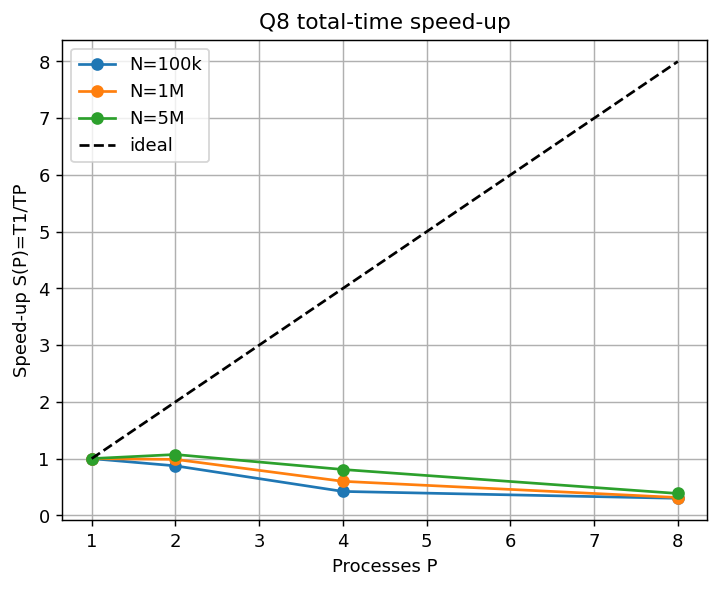
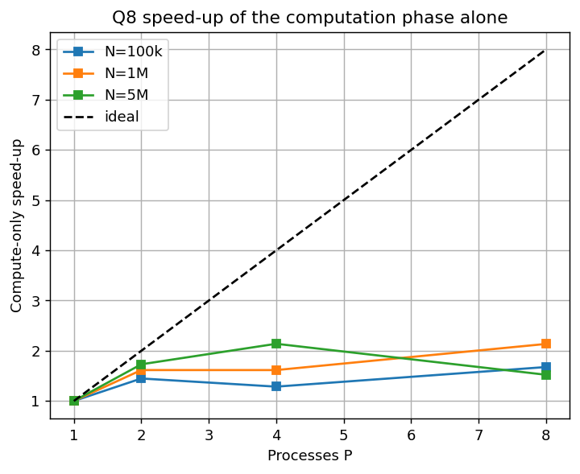

# Q8 — Large-Scale Weather & Environmental Data Analytics (MPI)

**Course:** Distributed Systems — Home Work 2
**Section:** Real-World Applications (Q8)

---

## 1. Problem

Given `N` weather measurements — each a `timestamp station_id temperature
humidity pressure rainfall wind_speed` — compute a fixed set of statistics:
totals; average/min/max of temperature, humidity and pressure; total and max
rainfall; average and max wind speed; a count of extreme-temperature events
(temp ≥ 40 or ≤ 0); the hottest and coldest single measurements; the busiest
60-second interval; and the Top-K stations by measurement count. Both a
**sequential** and an **MPI** implementation are required, plus a reproducible
**dataset generator**.

The first input line is `N K S`, where `K` is the K of Top-K and `S` is the
number of stations (station ids `0..S-1`).

---

## 2. Approach

The statistics are almost all **reductions** (sums, min, max, counts), which
parallelise naturally: each process computes partial statistics over a slice of
the data, and the partials are combined.

The design centres on a single mergeable `Stats` object (in `weather_core.h`):

- `add(record)` folds one measurement into the running statistics.
- `merge_into(A, B)` combines two partial `Stats` so that the result equals
  processing all their records in one pass.

Because the sequential program, the MPI program, and the checker all use this
same `add`/`merge_into`, the parallel result is identical to the sequential one
by construction.

**MPI data flow:**
1. Rank 0 reads the file and **scatters** the `N` records across the `P` ranks
   (`MPI_Scatterv`, handling `N` not divisible by `P`).
2. Each rank builds a **local `Stats`** over its chunk.
3. The local `Stats` are **gathered** to rank 0 (`MPI_Gatherv`) and combined with
   `merge_into`.
4. Rank 0 formats and prints.

Per the assignment's freedom on input distribution, rank 0 reads and scatters;
what matters is that the *work* is distributed, which it is.

---

## 3. Implementation details

**Output formatting.** All floating-point outputs use exactly **6 decimal
places** (`%.6f`); counts, ids and timestamps are integers. Timing goes to
**stderr**, so stdout carries only the required result.

**Tie-breaking (implemented exactly as specified):**
- Top-K stations: count descending, then station id ascending.
- Hottest / coldest: extreme temperature; ties → smaller timestamp, then smaller
  station id.
- Busiest interval: `interval = timestamp / 60`; max count, ties → smaller
  interval id.

**Extreme events:** counted when `temperature ≥ 40.0` OR `temperature ≤ 0.0`.

**Edge cases:** `N = 1`, `S = 1`, `K` larger than the number of stations present
(Top-K then lists only the stations that appear), and empty categories are all
handled.

**Numerical note.** Floating-point addition is not associative, so a parallel
reduction can differ from a single pass in the last bit. In practice, across all
tests and process counts, the 6-decimal output was identical between sequential
and MPI (verified below); this is expected because the generated values have
limited precision and the sums stay well within double precision.

---

## 4. Compilation and execution

```bash
module load hpcx-2.7.0/hpcx-ompi
mpicxx -O2 -std=c++17 -o weather_mpi weather_mpi.cpp
g++    -O2 -std=c++17 -o weather_seq weather_seq.cpp
g++    -O2 -std=c++17 -o gen_weather gen_weather.cpp

mpirun -np 4 --oversubscribe ./weather_mpi input.txt        # print result
./weather_seq input.txt                                     # sequential
./gen_weather 1000000 10 1000 42 data_1M.txt                # generate dataset
```

---

## 5. Correctness verification

A 13-case suite (`tests/`) compares MPI output **byte-for-byte** against the
sequential reference for P = 1, 2, 4, 8. Cases cover the sample, `N=1`, `S=1`,
`K > #stations`, all-extreme temperatures, the busiest-interval tie, the
hottest/coldest temperature tie, many stations, a single station at scale, and
awkward sizes.

**Result:** `TOTAL: 52 passed, 0 failed — ALL TESTS PASSED`
(13 cases × 4 process counts). Full log: `tests/correctness_results.txt`.

---

## 6. Dataset generation

`gen_weather N K S seed [outfile]` produces reproducible datasets (mt19937,
fixed seed → identical file every time). Value ranges: temperature `[-10,45]`,
humidity `[0,100]`, pressure `[950,1050]`, rainfall `[0,50]`, wind `[0,150]`
(all to 1 decimal place); timestamp integer in `[0, 60·N/4]`; station id in
`[0, S-1]`. The benchmark datasets use seed 42, `S = 1000`, `K = 10`.

---

## 7. Benchmark methodology

- **Environment:** RCE SLURM cluster, `debug` partition, single node, OpenMPI
  (HPC-X 2.7.0), `mpicxx -O2 -std=c++17`, `mpirun --oversubscribe`.
- **Sizes:** `N = 100 000`, `1 000 000`, `5 000 000` (`S=1000`, `K=10`, seed 42).
- **Process counts:** P = 1, 2, 4, 8.
- **Phase timing.** The timed region is split by barriers into three phases:
  `scatter` (distributing records — communication), `compute` (the local
  reduction — the parallelisable part), and `combine` (gathering and merging the
  partials on rank 0 — communication). This lets us separate computation from
  communication, as the deliverable asks.

---

## 8. Results

### 8.1 Total runtime (seconds)

| N | P=1 | P=2 | P=4 | P=8 |
|---|:---:|:---:|:---:|:---:|
| 100 000 | 0.007934 | 0.009098 | 0.018829 | 0.026428 |
| 1 000 000 | 0.114311 | 0.115914 | 0.190657 | 0.364176 |
| 5 000 000 | 1.037597 | 0.967898 | 1.284485 | 2.694831 |

### 8.2 Total-time speed-up  S(P) = T₁/T_P

| N | P=1 | P=2 | P=4 | P=8 |
|---|:---:|:---:|:---:|:---:|
| 100 000 | 1.00 | 0.87 | 0.42 | 0.30 |
| 1 000 000 | 1.00 | 0.99 | 0.60 | 0.31 |
| 5 000 000 | 1.00 | 1.07 | 0.81 | 0.39 |

### 8.3 Efficiency  E(P) = S(P)/P

| N | P=1 | P=2 | P=4 | P=8 |
|---|:---:|:---:|:---:|:---:|
| 100 000 | 1.00 | 0.44 | 0.11 | 0.04 |
| 1 000 000 | 1.00 | 0.49 | 0.15 | 0.04 |
| 5 000 000 | 1.00 | 0.54 | 0.20 | 0.05 |



*Figure 1 — Total-time speed-up. It stays at or below 1, i.e. adding processes
does not reduce wall-clock time for this workload.*

### 8.4 Phase breakdown for the largest dataset (N = 5 000 000, seconds)

| P | scatter (comm) | compute | combine (comm) | total |
|---|:---:|:---:|:---:|:---:|
| 1 | 0.036745 | 0.520616 | 0.480236 | 1.037597 |
| 2 | 0.050670 | 0.300708 | 0.616520 | 0.967898 |
| 4 | 0.062562 | 0.243316 | 0.978607 | 1.284485 |
| 8 | 0.123588 | 0.341935 | 2.229307 | 2.694831 |


*Figure 2 — Where the time goes at N = 5M. The `compute` slice shrinks with P
while `combine` (gather + merge on rank 0) grows and dominates.*

### 8.5 Compute-phase-only speed-up

| N | P=1 | P=2 | P=4 | P=8 |
|---|:---:|:---:|:---:|:---:|
| 100 000 | 1.00 | 1.45 | 1.29 | 1.68 |
| 1 000 000 | 1.00 | 1.62 | 1.62 | 2.14 |
| 5 000 000 | 1.00 | 1.73 | 2.14 | 1.52 |



*Figure 3 — Speed-up of the computation phase alone. The actual parallel work
does speed up (up to ~2×, the node's usable core count); it is simply a small
fraction of total time.*

---

## 9. Analysis: computation, communication, data distribution, scalability

**Headline: this workload is communication-bound.** The total-time speed-up sits
at or below 1 (best case S(2) = 1.07 at 5M), so more processes do not make the
program finish sooner. That is not an algorithmic defect — it is the expected
outcome when the per-record computation is trivial relative to the cost of moving
the records around, and the phase breakdown proves it.

**Computation *does* parallelise.** Isolating the `compute` phase (Figure 3), the
local reduction speeds up by roughly 1.6–2.1× at P = 2–4 — close to the two
usable cores this `debug` node provides. The reduction itself is embarrassingly
parallel; there is real parallel work being done.

**Communication and data distribution are the ceiling.** For the 5M dataset the
communication share of total time climbs steadily with P:

| P | compute share | communication share (scatter + combine) |
|---|:---:|:---:|
| 1 | 50.2 % | 49.8 % |
| 2 | 31.1 % | 68.9 % |
| 4 | 18.9 % | 81.1 % |
| 8 | 12.7 % | 87.3 % |

The dominant term is `combine`: each rank serialises its local `Stats` — which
includes per-station arrays of size `S = 1000` plus the interval map — and rank 0
gathers and merges all `P` of them **serially**. As P grows, rank 0 receives and
merges more partial state, so `combine` grows super-linearly (0.48 s → 2.23 s from
P = 1 to P = 8). The `scatter` phase also grows because more, smaller messages are
sent. Together these swamp the shrinking `compute` phase.

**Scalability.** Two limits stack here: (1) the algorithm concentrates the merge
on rank 0, an inherently serial O(P·(S + #intervals)) step that worsens with P;
and (2) the test node exposes only ~2 usable cores, so compute cannot scale past
~2× regardless. A more scalable design would replace the gather-and-merge-on-rank-0
step with tree-based collective reductions — `MPI_Reduce` (SUM) on the per-station
arrays and scalar accumulators, and `MPI_MINLOC/MAXLOC`-style reductions for the
hottest/coldest and busiest interval — so the combine cost grows as O(log P)
instead of O(P) and no single rank becomes the bottleneck. On hardware with more
cores per node, that would let the demonstrated compute speed-up carry through to
the total time.

**Effect of size.** Larger datasets fare slightly better (S(2) rises 0.87 → 0.99 →
1.07 for 100k → 1M → 5M) because more computation per record gives the parallel
work more to amortise the fixed communication against — the same
computation-vs-communication trade-off, seen across problem size.

---

## 10. Implementation notes

- **Compiler:** `-O2 -std=c++17`, OpenMPI HPC-X 2.7.0 on the `debug` partition.
- **Distribution:** `MPI_Scatterv` (records as raw bytes) handles `N` not
  divisible by `P`; ranks with zero records are valid.
- **Combine:** local `Stats` serialised and gathered with `MPI_Gatherv`, merged
  on rank 0 with the same `merge_into` used by the sequential path.
- **Launch:** `mpirun --oversubscribe` (P = 8 shares the node's cores) with
  `OMPI_MCA_coll_hcoll_enable=0` to silence a benign HCA warning.
- **Output:** floats to 6 decimals; timing to stderr only.

---

## 11. Conclusion

The MPI weather-analytics implementation is **correct** (52/52 checks across all
edge cases and P = 1, 2, 4, 8) and its behaviour is fully explained by the phase
decomposition. The computation parallelises (~2× on the two available cores), but
the workload is **communication-bound**: the cost of distributing records and,
especially, gathering and merging partial results on rank 0 grows with P and
dominates total time (up to 87 % at P = 8). The clear next step for scalability is
to replace the serial rank-0 merge with tree-based MPI collective reductions,
which would cut the combine cost from O(P) to O(log P) and allow the demonstrated
compute speed-up to translate into end-to-end speed-up on many-core hardware.
